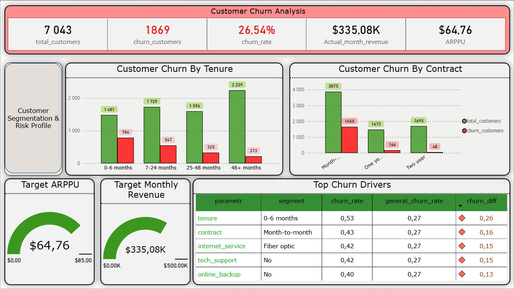
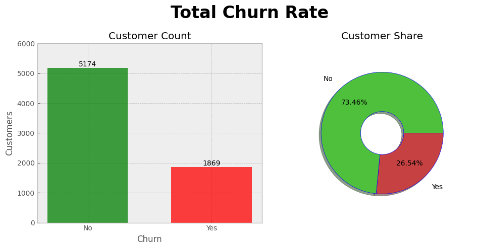
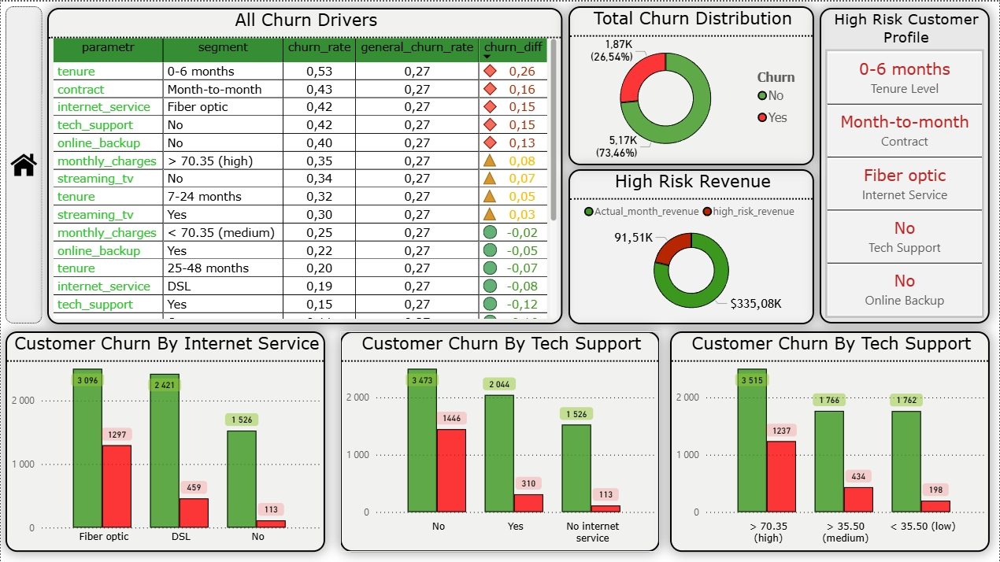
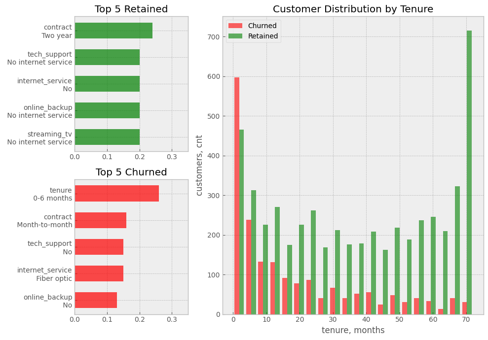

# Анализ Оттока Клиентов Телеком-Компании

> **Дисклеймер:** проект выполнен на синтетических данных выдуманной компании в образовательных целях для демонстрации аналитических навыков.

<div align="center">
    
    <br>
    <em>Рис. 1 - Фрагмент разработанного дашборда Power BI</em>
</div>

## Summary проекта

Компания столкнулась с повышенным уровнем оттока клиентов, что негативно влияет на удержание аудитории и стабильность выручки. В связи с этим бизнесу необходимо определить ключевые факторы, связанные с churn, выявить наиболее рискованные сегменты клиентов и сформировать рекомендации по снижению уровня оттока.

В рамках данного проекта проводится анализ клиентского оттока (*customer churn*) телеком-компании на основе датасета, содержащего информацию о клиентах, подключённых услугах, типах контрактов и платежах.

---

## 1. Постановка бизнес-задачи

**Цель исследования:** 
Определить факторы, влияющие на отток клиентов, выявить наиболее рискованные клиентские сегменты и сформировать рекомендации по удержанию пользователей.

В рамках анализа необходимо ответить на следующие вопросы:

1. Какие характеристики клиентов наиболее связаны с высокой вероятностью оттока?
2. Какие типы контрактов и способы оплаты ассоциированы с повышенным churn-rate?
3. Как срок пользования услугами (*tenure*) влияет на вероятность ухода клиента?
4. Связано ли использование дополнительных услуг компании с уровнем оттока?
5. Какие клиентские сегменты можно считать наиболее рискованными с точки зрения churn?
6. Какие бизнес-меры потенциально могут снизить уровень оттока клиентов?

## 2. Анализ данных

### 2.1 Структура датасета

**Описание ключевых полей:**

- `tenure` — срок пользования услугами компании (в месяцах)
- `monthly_charges` — ежемесячный платёж клиента
- `total_charges` — суммарные платежи клиента за весь период
- `contract` — частота оплаты услуг
- `payment_method` — способ оплаты услуг
- `churn` — признак оттока клиента:

### 2.2 Валидация и проверка качества данных

```sql
-- Ознакомление с датасетом:
select *
from telecom
limit 5
```

| customer_id | gender | senior_citizen | Partner | Dependents | tenure | phone_service | multiple_lines | internet_service | online_security | online_backup | device_protection | tech_support | streaming_tv | streaming_movies | Contract | paperless_billing | payment_method | monthly_charges | total_charges | Churn |
| --- | --- | --- | --- | --- | --- | --- | --- | --- | --- | --- | --- | --- | --- | --- | --- | --- | --- | --- | --- | --- |
| 7892-POOKP | Female | 0 | Yes | No | 28 | Yes | Yes | Fiber optic | No | No | Yes | Yes | Yes | Yes | Month-to-month | Yes | Electronic check | 104.8 | 3046.05 | Yes |
| 6388-TABGU | Male | 0 | No | Yes | 62 | Yes | No | DSL | Yes | Yes | No | No | No | No | One year | No | Bank transfer (automatic) | 56.15 | 3487.95 | No |
| 9763-GRSKD | Male | 0 | Yes | Yes | 13 | Yes | No | DSL | Yes | No | No | No | No | No | Month-to-month | Yes | Mailed check | 49.95 | 587.45 | No |
| 7469-LKBCI | Male | 0 | No | No | 16 | Yes | No | No | No internet service | No internet service | No internet service | No internet service | No internet service | No internet service | Two year | No | Credit card (automatic) | 18.95 | 326.8 | No |
| 8091-TTVAX | Male | 0 | Yes | No | 58 | Yes | Yes | Fiber optic | No | No | Yes | No | Yes | Yes | One year | No | Credit card (automatic) | 100.35 | 5681.1 | No |

```sql
-- Кол-во строк в датасете:
**select** **count**(*) **as** *total_rows*
**from** telecom
```

| total_rows |
| --- |
| 7,043 |

```sql
-- Есть ли дубликаты:
select
    customer_id,
    count(*) as duplicates_count
from telecom
group by customer_id
having count(*) > 1
```

Дубликатов нет

```sql
-- Проверка NULL и пустых значений:
select *
from telecom
where monthly_charges is null
	or (total_charges is null and tenure != 0)
	or monthly_charges < 0
	or total_charges < 0 
```

NULL и пустых значений нет

### 2.3 Анализ целевой переменной (churn)

```sql
-- Распределение клиентов по churn:
select
    churn,
    count(*) customers,
    round(count(*) * 100.0 / sum(count(*)) over(), 2) percent_custimers
from telecom
group by churn
```

| churn | customers | percent_customers |
| --- | --- | --- |
| No | 5174 | 73.46 |
| Yes | 1869 | 26.54 |

Компания теряет почти каждого 4 клиента. Далее нужно выяснить, что формирует такой высокий churn rate.

<br>
<div align="center">
    
	<br>
	<em>Рис. 2 - Графики из matplotlib с распределение клиентов по churn rate</em>
</div>

### 2.4 Выбор значимых параметров для анализа churn

На данном этапе необходимо отобрать параметры, на которые бизнес способен влиять и которые потенциально могут оказывать влияние на клиентский отток. В связи с этим влияние следующих параметров будет проанализировано на churn-rate: 

- tenure
- internet_service
- online_backup
- tech_support
- streaming_tv
- streaming_movies
- contract
- monthly_charges

```sql
-- Анализ влияния параметров на churn:
with all_churn_rate as(
	select
		'tenure' parametr,
		case
			when tenure <= 6 then '0-6 months'
			when tenure <= 24 then '7-24 months'
			when tenure <= 48 then '25-48 months'
			else '48+ months'
		end as segment,
		round(avg(case when churn = 'Yes' then 1 else 0 end), 2) churn_rate
	from telecom
	group by segment

	union all

/* Значения, которые подставим в case под monthly_charges
 select
    min(monthly_charges),
    percentile_cont(0.25) within group (order by monthly_charges),
    percentile_cont(0.5) within group (order by monthly_charges),
    percentile_cont(0.75) within group (order by monthly_charges),
    max(monthly_charges)
from telecom */

	select
		'monthly_charges' parametr,
		case
			when monthly_charges < 35.5 then '< 35.5 (low)'
			when monthly_charges < 70.35 then '< 70.35 (medium)'
			else '> 70.35 (high)'
		end segment,
		round(avg(case when churn = 'Yes' then 1 else 0 end), 2) churn_rate
		from telecom
		group by segment

	union all

	select
		'internet_service' parametr,
		internet_service as segment,
		round(avg(case when churn = 'Yes' then 1 else 0 end), 2) churn_rate
	from telecom
	group by segment

	union all

	select
		'online_backup' parametr,
		online_backup as segment,
		round(avg(case when churn = 'Yes' then 1 else 0 end), 2) churn_rate
	from telecom
	group by segment

	union all

	select
		'tech_support' parametr,
		tech_support as segment,
		round(avg(case when churn = 'Yes' then 1 else 0 end), 2) churn_rate
	from telecom
	group by segment

	union all

	select
		'streaming_tv' parametr,
		streaming_tv as segment,
		round(avg(case when churn = 'Yes' then 1 else 0 end), 2) churn_rate
	from telecom
	group by segment

	union all

	select
		'contract' parametr,
		contract as segment,
		round(avg(case when churn = 'Yes' then 1 else 0 end), 2) churn_rate
	from telecom
	group by segment
), general_churn_rate as(
	select
		round(avg(case when churn = 'Yes' then 1 else 0 end), 2) general_churn_rate
	from telecom
)
select
	acr.*,
	gcr.general_churn_rate,
	round(acr.churn_rate - gcr.general_churn_rate, 2) as churn_diff
from all_churn_rate acr
cross join general_churn_rate gcr
order by churn_rate desc ```
```

| parametr | segment | churn_rate | general_churn_rate | churn_diff |
| --- | --- | --- | --- | --- |
| tenure | 0-6 months | 0.53 | 0.27 | 0.26 |
| contract | Month-to-month | 0.43 | 0.27 | 0.16 |
| tech_support | No | 0.42 | 0.27 | 0.15 |
| internet_service | Fiber optic | 0.42 | 0.27 | 0.15 |
| online_backup | No | 0.40 | 0.27 | 0.13 |
| monthly_charges | > 70.35 (high) | 0.35 | 0.27 | 0.08 |
| streaming_tv | No | 0.34 | 0.27 | 0.07 |
| tenure | 7-24 months | 0.32 | 0.27 | 0.05 |
| streaming_tv | Yes | 0.30 | 0.27 | 0.03 |
| monthly_charges | < 70.35 (medium) | 0.25 | 0.27 | -0.02 |
| online_backup | Yes | 0.22 | 0.27 | -0.05 |
| tenure | 25-48 months | 0.20 | 0.27 | -0.07 |
| internet_service | DSL | 0.19 | 0.27 | -0.08 |
| tech_support | Yes | 0.15 | 0.27 | -0.12 |
| monthly_charges | < 35.5 (low) | 0.11 | 0.27 | -0.16 |
| contract | One year | 0.11 | 0.27 | -0.16 |
| tenure | 48+ months | 0.10 | 0.27 | -0.17 |
| online_backup | No internet service | 0.07 | 0.27 | -0.20 |
| internet_service | No | 0.07 | 0.27 | -0.20 |
| tech_support | No internet service | 0.07 | 0.27 | -0.20 |
| streaming_tv | No internet service | 0.07 | 0.27 | -0.20 |
| contract | Two year | 0.03 | 0.27 | -0.24 |

<br>
<div align="center">
    
	<br>
	<em>Рис. 3 - Анализ в Power BI</em>
</div>
<br>

<br>
<div align="center">
    
	<br>
	<em>Рис. 4 - Анализ в matplotlib</em>
</div>
<br>

### 3. Результаты анализа

**Наиболее высокий отток клиентов наблюдается среди:**

- новых клиентов (tenure в диапазоне 0-6 месяцев)
- пользователей с month-to-month оплатой
- клиентов без поддержки (tech_support = No)
- пользователей с оптоволоконным интернетом (fiber optic)
- клиентов без дополнительных сервисов (online_backup, streaming_tv)

**Полученные результаты позволяют предположить, что клиентский отток по большей части связан:**

- с новыми клиентами (возможно, услуги не соответствуют ожиданиям клиентов / плохой onboarding)
- с отсутствием долгосрочных контрактных обязательств, что снижает switching cost клиентов на других операторов
- c недостаточной вовлечённостью клиента в экосистему сервисов компании (bundle effect)

**При этом можем заметить, что:**

- one year и two year оплата в рамках анализа связаны с минимальным уровнем churn rate
- “старые клиенты” (tenure 24+ месяца) остаются клиентами компаниями и далее
- использование дополнительных услуг компании позволяет уменьшить churn rate

### 4. Бизнес рекомендации

Исходя из результатов анализа выше можно предложить следующие меры работы с churn rate:

- Усилить onboarding-процессы для новых клиентов (гайды по сервисам, объяснение всех возможностей тарифа и услуг, опросы о качестве услуг)
- Стимулировать переход на оплату one year / two year (предлагать скидки на годовые тарифы и привлекательные условия тарифов)
- Стимулировать подключение bundled-услуг для лучшего удержания клиента через единый тариф и другие способы

---

**Инструменты проекта**
- SQL
- Python (matplotlib, pandas, sqlalchemy)
- Power BI
